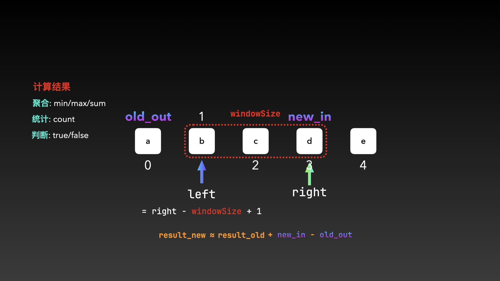

# Fixed-Size_Sliding_Window

定长滑动窗口是利用双指针划定一个固定大小的区间，这个区间（窗口）每次滑动时仅需根据新进入和旧移出窗口的元素来快速更新计算结果。计算结果通常指的是根据当前窗口内的元素特性进行的聚合、统计或判断操作后的结果。而这里的快速更新则指的是「基于上一个状态，通过微小的调整（加上新的，减去旧的）得到当前状态的结果，从而避免了重复计算。」
$$
R_新 ≈ R_旧 + new\_in - old\_out
$$
需要注意的是，当以右边界为right、区间大小为windowSize的滑动窗口在线性容器中滑动时，左边界left下标 = right - windowSize + 1（old_out的下标为right - windowSize）。请记住这个结论。



## 定长滑动窗口模版

若是在计算窗口自身的整体属性，一段式写法和二段式写法均适用。若是在比较一个外部元素和窗口内部的元素，仅二段式适用，如leetcode 220。

一段式写法：

```C++
int n = s.size();
if (n < k) {
    // return
}

for (int i = 0; i < n; ++i) { //窗口的右边界
	// 1. 进入窗口的元素  
  
  // 利用left保证窗口大小
  int left = i - k + 1; //当前窗口的左边界
  
  // 2. 更新窗口状态
  
  // 3. 移出窗口元素
}
```

二段式写法：

```C++
int n = s.size();
if (n < k) {
        // return
}

// 阶段一：填充初始窗口 (处理前 k 个元素)
for (int i = 0; i < k; ++i) {
    // 将 s[i] 加入窗口，并更新 window_state
}

// 阶段二：滑动窗口 (处理从第 k 个到最后的元素)
for (int i = k; i < n; ++i) {
    // 核心滑动操作：“右进一，左出一”
        
    // 1. 将右侧新元素 s[i] 加入窗口

    // 2. 将左侧旧元素 s[i-k] 移出窗口

    // 3. 对滑动后的新窗口，进行一次结果处理
    /* --- 核心判断逻辑：根据 window_state 更新 ans --- */
}
```


## leetocde 1456

使用一个大小为 k 的滑动窗口，在遍历字符串时，维护窗口内元音字母的数量，并持续更新最大值。

一段式写法：

```C++
class Solution {
public:
    int maxVowels(string s, int k) {
        int n = s.size();
        int vowelNum = 0, result = 0;

        auto isVowel = [](char c) {
            return c == 'a' || c == 'e' || c == 'i' || c == 'o' || c == 'u';
        };
        
        for (int i = 0; i < n; ++i) {
            vowelNum += isVowel(s[i]);

            int left = i - k + 1;
            if (left < 0) continue;

            result = max(result, vowelNum);

            vowelNum -= isVowel(s[left]);
        }

        return result;
    }
};
```

二段式：

```C++
class Solution {
public:
    bool isVowel(char ch) {
        return ch == 'a' || ch == 'e' || ch == 'i' || ch == 'o' || ch == 'u';
    }
  
    int maxVowels(string s, int k) {
        int vowel_num = 0;
        for (int i = 0; i < k; ++i) {
            vowel_num += isVowel(s[i]);
        }

        if (vowel_num == k) return k;

        int length = s.size();
        int ans = vowel_num;
        for (int i = k; i < length; ++i) {
            vowel_num += isVowel(s[i]) - isVowel(s[i-k]);

            if (vowel_num == k) return k;
            ans = max(vowel_num, ans);
        }

        return ans;
    }
};
```

## leetcode 643

使用一个大小为 k 的滑动窗口，在一次遍历中找到和最大的连续子数组，然后将其和除以 k 得到最终结果。

一段式：

```C++
class Solution {
public:
    double findMaxAverage(vector<int>& nums, int k) {
        int result = INT_MIN;

        int n = nums.size(), curSum = 0;
        for (int i = 0; i < n; ++i) {
            curSum += nums[i];

            int left = i - k + 1;
            if (left < 0) continue;

            result = max(result, curSum);

            curSum -= nums[left];
        }

        return static_cast<double>(result) / k;
    }
};
```

二段式：

```C++
class Solution {
public:
    double findMaxAverage(vector<int>& nums, int k) {
        int length = nums.size();

        int curSum = 0;
        for(int i = 0; i < k; ++i) {
            curSum += nums[i];
        }

        int ans = curSum;
        for(int i = k; i < length; ++i) {
            curSum += nums[i] - nums[i - k];
            ans = max(curSum, ans);
        }

        return static_cast<double>(ans) / k;   
    }
};
```

## leetcode 1343

使用大小为 k 的滑动窗口遍历数组，计算每个窗口的和并判断其是否大于等于 k 乘以 threshold，然后统计满足条件的窗口数量。

一段式：

```C++
class Solution {
public:
    int numOfSubarrays(vector<int>& arr, int k, int threshold) {
        int targetSum = k * threshold;
        int n = arr.size(), curSum = 0, result = 0;

        for (int i = 0; i < n; ++i) {
            curSum += arr[i];

            int left = i - k + 1;
            if (left < 0) continue;

            if (curSum >= targetSum) {
                result++;
            }

            curSum -= arr[left];
        }

        return result;
    }
};
```

二段式：

```C++
class Solution {
public:
    int numOfSubarrays(vector<int>& arr, int k, int threshold) {
        int totalSum = k * threshold;

        int curSum = 0;
        for (int i = 0; i < k; i++) {
            curSum += arr[i];
        }
        
        int result = 0, length = arr.size();
        result += curSum >= totalSum ? 1 : 0;

        for (int i = k; i < length; i++) {
            curSum += arr[i] - arr[i - k];
            result += curSum >= totalSum ? 1 : 0;
        }

        return result;
    }
};
```

## leetcode 2090

使用大小为 2k+1的滑动窗口遍历数组，计算每个中心点范围的窗口平均值并保存在作为结果的线性容器中。

```C++
class Solution {
public:
    vector<int> getAverages(vector<int>& nums, int k) {
        int n = nums.size();
        vector<int> result(n, -1);

        long long curSum = 0;

        for (int i = 0; i < n; ++i) {
            curSum += nums[i];

            int left = i - 2 * k;
            if (left < 0) continue;

            result[i - k] = curSum / (2 * k + 1);

            curSum -= nums[left];
        }

        return result;
    }
};
```

注意，这里的中心点坐标也就是对应结果容器的下标为i - k，左边界left为i - 2k，这里的i是窗口的右边界right。

## leetcode 2379

使用大小为 **k** 的滑动窗口，一次遍历找出包含白色方块数量最少的窗口，该白色方块数量即为答案。

一段式写法：

```C++
class Solution {
public:
    int minimumRecolors(string blocks, int k) {
        int n = blocks.size(), cnt_w = 0, result = n;

        for (int i = 0; i < n; ++i) {
            cnt_w += (blocks[i] & 1);

            int left = i - k + 1;
            if (left < 0) continue;

            result = min(result, cnt_w);

            cnt_w -= (blocks[left] & 1);
        }

        return result;
    }
};
```

二段式写法：

```C++
class Solution {
public:
    int minimumRecolors(string blocks, int k) {
        int cnt_w = 0;
        for (int i = 0; i < k; ++i) {
            cnt_w += blocks[i] & 1;
        }

        if(cnt_w == 0) return 0;

        int result = cnt_w;
        for(int i = k; i < blocks.length(); ++i) {
            cnt_w += (blocks[i] & 1) - (blocks[i - k] & 1);
            result = min(cnt_w, result);
        }

        return result;
    }
};
```

注意，W的ASCII码的最后一位是1，而B的ASCII码最后一位是0，可用此特性进行区分黑白砖块。这样做的好处是能够减少CPU在执行条件分支跳转的额外周期。

## leetcode 2841

使用一个大小为 **k** 的滑动窗口，并记录哈希表统计窗口内不同元素的数量，当不同元素数量大于等于 **m** 时，更新并记录最大的窗口元素和。

一段式写法：

```C++
class Solution {
public:
    long long maxSum(vector<int>& nums, int m, int k) {
        int n = nums.size();
        long long curSum = 0, result = 0;
        unordered_map<int, int> cnt;

        for (int i = 0; i < n; ++i) {
            int in = nums[i];
            curSum += in;
            cnt[in]++;

            int left = i - k + 1;
            if (left < 0) continue;

            if (cnt.size() >= m) {
                result = max(result, curSum);
            }

            int out = nums[left];
            curSum -= out;
            if (--cnt[out] == 0) {
                cnt.erase(out);
            }
        }

        return result;
    }
};
```

## leetcode 2461

和leetcode 2841基本完全一致，只需在哈希表统计窗口内不同元素的数量 == m时才进行结果的更新。

```C++
class Solution {
public:
    long long maximumSubarraySum(vector<int>& nums, int k) {
        long long sum = 0, result = 0;
        unordered_map<int, int> count;
        for( int i = 0; i < nums.size(); ++i ) {
            sum += nums[i];
            count[nums[i]]++;

            int left = i - k + 1;
            if ( left < 0 ) continue;

            if ( k == count.size() ) {
                result = max(result, sum);
            }

            int out = nums[left];
            sum -= out;
            if( --count[out] == 0 ) {
                count.erase(out);
            }
        }

        return result;
    }
};
```

## leetcode 1423

常规思路是采用逆向思维将其转换为大小为n-k的滑动窗口问题。即转换为在数组中找到一个长度为 n-k 的连续子数组，使其和最小，然后用整个数组的求和减去连续子数组和的最小值即可。

如果直接正向思维求解，原问题相当于从两端取 k 个数求最大和。即可以从左边取0个右边取k个，左1右k-1，...，左k右0。也就是一共需要考虑k+1种取法。正向求解本质上也是一个长为k的**滑动窗口**，只不过窗口的两端分别在数组的头部和尾部。

逆向思维：

```C++
class Solution {
public:
    // 问题转化为计算长为 n−k 的连续子数组和的最小值。
    int maxScore(vector<int>& cardPoints, int k) {
        int totalSum = reduce(cardPoints.begin(), cardPoints.end());
        int result = totalSum;
        int n = cardPoints.size();
        int m = n - k;

        if (m == 0) return totalSum;

        int curSum = 0;
        for( int i = 0; i < n; ++i ) {
            curSum += cardPoints[i];

            int left = i - m + 1;
            if (left < 0) continue;

            result = min(result, curSum);

            curSum -= cardPoints[left];
        }

        return totalSum - result;
    }
};
```

正向思维：

```C++
class Solution {
public:
    // 正向思维：计算长为 k 的连续子数组（在数组的两端连续）和的最大值。
    int maxScore(vector<int>& cardPoints, int k) {
        int curSum = reduce(cardPoints.begin(), cardPoints.begin() + k);
        int n = cardPoints.size(), result = curSum;

        for (int i = 1; i <= k; ++i) {
            curSum += cardPoints[n - i] - cardPoints[k - i];
            result = max(result, curSum);
        }

        return result;
    }
};
```

## leetcode 1052

使用一个大小为 **minutes** 的滑动窗口，找出老板施展秘密技巧时能挽回的最多顾客数，然后加上原本就不生气时的顾客总数，即为最终答案。这里一个技巧是使用一个数组, 下标为0的位置存储原本就不生气的顾客总数，下标为1的位置存储滑动窗口的最大连续子数组的和。

```C++
class Solution {
public:
    int maxSatisfied(vector<int>& customers, vector<int>& grumpy, int minutes) {
        int n = customers.size();
        int curSum[2] = {}, result_s1 = 0;

        for (int i = 0; i < n; ++i) {
            curSum[grumpy[i]] += customers[i];

            int left = i - minutes + 1;
            if (left < 0) continue;

            result_s1 = max(curSum[1], result_s1);

            curSum[1] -= grumpy[left] ? customers[left] : 0;
        }

        return curSum[0] + result_s1;
    }
};
```

## leetcode 1652

根据 **k** 的正负，使用一个大小为 **abs(k)** 的滑动窗口，并通过模运算来处理循环边界，从而计算出每个位置对应的前 **k** 个或后 **k** 个元素的和。需要注意的是，当 k > 0 时，初始窗口区间为[1, k+1)左闭右开；当 k < 0 时初始窗口区间为[n - abs(k), n)左闭右开。

```C++
class Solution {
public:
    vector<int> decrypt(vector<int>& code, int k) {
        int n = code.size();
        vector<int> result(n);

        int right = k > 0 ? k + 1 : n;
        k = abs(k);
        int curSum = reduce(code.begin() + right - k, code.begin() + right);
        for (int i = 0; i < n; ++i) {
            result[i] = curSum;
            curSum += code[right % n] - code[(right - k) % n];
            right++;
        }

        return result;
    }
};
```

## leetcode 3439

以转换为在长度为n+1的线性容器中，使用大小为k+1的滑动窗口，得到连续的最大的子数组的和。

这样进行问题转化的原因是 n个会议会将整个时间轴分割成多个部分，可以把会议想象成 n 个隔板，n个隔板会形成 n+1个区域，分别是：

* 第一个会议开始之前的空余时间。
* 第一个会议和第二个会议之间的空余时间。
* ...
* 第 n-1 个会议和第 n 个会议之间的空余时间。
* 第 n 个会议结束之后的空余时间。

注意：当两个搁板紧密相连时，其中的间隔时间就是0了。也就说，虽然n个搁板会形成n+1个区域，但其中部分区域的间隔可以为0。

现在，我需要重新安排k个会议，也就是移除（重新安排）k 个搁板，就会让原本被这 k 个搁板（会议）分隔开的 k+1 个相邻空闲时间段连通并合并成一个更大的空闲时间段。

使用大小为n+1数组存储的数组存储搁板分隔出的区间大小：

```C++
class Solution {
public:
    int maxFreeTime(int eventTime, int k, vector<int>& startTime, vector<int>& endTime) {
        int n = startTime.size();
        vector<int> gaps(n + 1);

        gaps[0] = startTime[0];
        for(int i = 1; i < n; ++i) {
            gaps[i] = startTime[i] - endTime[i - 1];
        }
        gaps[n] = eventTime - endTime[n - 1];

        int curSum = 0, result = 0;
        int m = k + 1;
        for (int i = 0; i <= n; ++i) {
            curSum += gaps[i];

            int left = i - m + 1;
            if (left < 0) continue;

            result = max(result, curSum);

            curSum -= gaps[left];
        }

        return result;
    }
};
```

优化空间复杂度：

```C++
class Solution {
public:
    int maxFreeTime(int eventTime, int k, vector<int>& startTime, vector<int>& endTime) {
        int n = startTime.size();

        auto gaps = [=](int i) -> int {
            if (i == 0) {
                return startTime[0];
            }

            if (i == n) {
                return eventTime - endTime[n - 1];
            }

            return startTime[i] - endTime[i - 1];
        };

        int curSum = 0, result = 0;
        int m = k + 1;
        for (int i = 0; i <= n; ++i) {
            curSum += gaps(i);

            int left = i - m + 1;
            if (left < 0) continue;

            result = max(result, curSum);

            curSum -= gaps(left);
        }

        return result;
    }
};
```

## leetcode 2134

首先统计数组中 1 的总数作为滑动窗口的大小，然后在循环数组（拼接+取模实现）上滑动该窗口，找到包含 0 最少的窗口，这个最少的 0 的数量即为最小交换次数。注意：因为数组是**循环**的，所以这些窗口也要能“跨越”数组的头尾。

在循环数组（容器长度为n）中，恰好有 n 个这样的窗口。分别是：

- 从 nums[0] 开始的窗口: [nums[0], ..., nums[k-1]]
- 从 nums[1] 开始的窗口: [nums[1], ..., nums[k]]
- ...
- 从 nums[n-1] 开始的窗口: [nums[n-1], nums[0], ..., nums[k-2]] 

一共有n + k - 1个元素，因此循环数组扩展后的元素下标范围[0, n + k - 1)。

注意最后一个窗口的元素的横跨了数组的头尾，因此，超过数组原有的下标部分的元素，采用取模来访问。

```C++
class Solution {
public:
    int minSwaps(vector<int>& nums) {
        int n = nums.size();
        int k = reduce(nums.begin(), nums.end());

        int curSum = 0, result = n;
        for (int i = 0; i < n + k - 1; ++i) {
            curSum += 1 - nums[i % n];

            int left = i - k + 1;
            if (left < 0) continue;

            result = min(result, curSum);

            curSum -= 1 - nums[left];
        }

        return k != 0 ? result : 0;
    }
};
```

## leetcode 1297

忽略 maxSize 的条件，使用一个大小为 minSize 的滑动窗口遍历字符串，并用哈希表统计所有满足不同字符数小于等于 maxLetters 的子串的出现次数，最后返回最大的次数即可。

为什么忽略 maxSize 的条件？ 要求的是重复最多的子串，那么一定是最小的串重复的更多。

```C++
class Solution {
public:
    int maxFreq(string s, int maxLetters, int minSize, int maxSize) {
        int n = s.size(), result = 0;
        unordered_map<string, int> substr_cnt;
        unordered_map<char, int> ch_cnt;

        for (int i = 0; i < n; ++i) {
            char in = s[i];
            ch_cnt[in]++;

            int left = i - minSize + 1;
            if (left < 0) continue;

            if (ch_cnt.size() <= maxLetters) {
                string sub = s.substr(left, minSize);
                substr_cnt[sub]++;
                result = max(result, substr_cnt[sub]);
            }

            char out = s[left];
            ch_cnt[out]--;
            if (ch_cnt[out] == 0) {
                ch_cnt.erase(out);
            }
        }

        return result;
    }
};
```

## leetcode 2653

leetcode2653的解决方案是在大小为k的滑动窗口内使用一个频率数组来高效统计各数字的出现次数，并在每个窗口中通过累加频率快速定位第 x 小的负数作为子数组的美丽值。

首先，为什么子数组的数量是n - k + 1？因为

* 第一个子数组是 nums[0], nums[1], ..., nums[k-1]，
* 最后一个子数组是 nums[n-k],..., nums[n-1]，

一共有(n-1) - (k-1) + 1 = n - k + 1 子数组。且记录答案结果的容器下标就是每个窗口的左边界left。

其次，如何高效的确定每个窗口中第 x 小的数的是多少？我们可以用计数排序来高效确定，假设num是第 x 小的数，那么在 num 之前一定凑不齐 x 个数，但一旦包含 num，总数就达到了 x 个，所以 num 正好卡在第 x 小的位置上。用夹逼定理来表示即可以写成如下两个不等式：
$$
count(numbers<NUM) < x ≤ count(numbers≤NUM)
$$
或者
$$
count(numbers≤NUM−1) < x ≤count(numbers≤NUM)
$$

```C++
class Solution {
public:
    vector<int> getSubarrayBeauty(vector<int>& nums, int k, int x) {
        int n = nums.size();
        vector<int> result(n - k + 1);

        const int BIAS = 50;
        int cnt[2 * BIAS + 1] = {};
        for (int i = 0; i < n; ++i) {
            cnt[nums[i] + BIAS]++;

            int left = i - k + 1;
            if (left < 0) continue;

            int temp = x;
            for(int j = 0; j < BIAS; ++j) {
                temp -= cnt[j];
                if (temp <= 0) {
                    result[left] = j - BIAS;
                    break;
                }
            }

            cnt[nums[left] + BIAS]--;
        }

        return result;
    }
};
```

## leetcode 1888

匹配01或者10交替的目标模式，通过将原字符串与自身首尾拼接，使用一个长度为n的滑动窗口遍历拼接后的字符串（取模），以及利用两种交替模式的对称性，记录最少的翻转次数。

将01循环设为A模式，10循环设为B模式。由于字符串可以反复删除首元素加到结尾，那么就相当于将原字符串 s 复制一份接在自己后面，形成一个新的字符串 ss = s + s。例如，如果 s = "11100"，那么 ss = "1110011100"。

这样做的原因是在这个新的长字符串 ss 中，任何长度为 n (原字符串 s 的长度) 的子串，都对应着原字符串 s 通过一次“去首加尾”操作能得到的所有可能情况。例如，ss 中从索引 0 开始长度为 n 的子串就是原字符串，从索引 1 开始长度为 n 的子串就是将原字符串第一个字符移到末尾后的字符串，以此类推。注意： [0,n−1] 和 [n,2n−1] 是同一个字符串，因此ss可以不使用最后一个字符。

现在，问题就变成了在 ss 上找到一个长度为 n 的窗口，使得这个窗口内的子串与上述两种目标交替模式的差异最小。

注意由于两种模式的对称性: 

* 如果当前字符与模式 A 的对应字符相同，那么它一定与模式 B 的对应字符不同。
* 如果当前字符与模式 A 的对应字符不同，那么它一定与模式 B 的对应字符相同。

因此有匹配模式A的反转次数和匹配模式B的反转次数和等于窗口长度。其中较小值即为所求。

```C++
class Solution {
public:
    int minFlips(string s) {
        int n = s.size();

        int cnt = 0, result = n / 2;
        for (int i = 0; i < 2 * n - 1; ++i) {
            cnt += s[i % n] % 2 == i % 2;

            int left = i - n + 1;
            if (left < 0) continue;

            result = min({result, cnt, n - cnt});

            cnt -= s[left] % 2 == left % 2;
        }
        return result;
    }
};
```

## leetcode 567

通过一个大小与s1长度相等的滑动窗口来扫描s2，并利用两个频率数组（哈希表）判断窗口内子串的字符种类和数量是否与s1完全一致。

```C++
class Solution {
public:
    bool checkInclusion(string s1, string s2) {
        int k = s1.size();
        int n = s2.size();

        if (k > n) return false;

        vector<int> cnt1(26), cnt2(26);
        for (int i = 0; i < n; ++i) {
            if (i < k) cnt1[s1[i] - 'a']++;

            cnt2[s2[i] - 'a']++;

            int left = i - k + 1;
            if (left < 0) continue;

            if (cnt1 == cnt2) {
                return true;
            }

            cnt2[s2[left] - 'a']--;
        }

        return false;
    }
};
```

将

```C++
            if (cnt1 == cnt2) {
                return true;
            }
```

从O(26)优化到O(1)， 思路详解见leetcode 30:

```C++
class Solution {
public:
    bool checkInclusion(string s1, string s2) {
        int k = s1.size();
        int n = s2.size();

        if (k > n) return false;

        vector<int> cnt1(26), cnt2(26);

        for (int i = 0; i < k; ++i) {
            cnt1[s1[i] - 'a']++;
        }
        
        int mismatchType = 0; // 失配字符类别数
        for (int i = 0; i < n; ++i) {
            int in = s2[i] - 'a';
            if (cnt1[in] == cnt2[in]) {
                mismatchType++;
            }

            cnt2[in]++;

            int left = i - k + 1;
            if (left < 0) continue;

            if (mismatchType == 0) {
                return true;
            }

            int out = s2[left] - 'a';
            if (cnt2[out] == cnt1[out] + 1) {
                mismatchType--;
            }
            cnt2[out]--;
        }

        return false;
    }
};
```

## leetcode 438

与leetcode567的思路完全一致，唯一不同的就是需要记录每一个满足条件的窗口的左边界即可。

```C++
class Solution {
public:
    vector<int> findAnagrams(string s, string p) {
        vector<int> result;

        int k = p.size();
        int n = s.size();

        if (k > n) return result;

        vector<int> cnt1(26), cnt2(26);

        for (int i = 0; i < k; ++i) {
            cnt1[p[i] - 'a']++;
            cnt2[s[i] - 'a']++;
        }

        if (cnt1 == cnt2) {
            result.push_back(0);
        }

        for(int i = k; i < n; ++i) {
            cnt2[s[i] - 'a']++;
            cnt2[s[i - k] - 'a']--;

            if (cnt1 == cnt2) {
                result.push_back(i - k + 1);
            }
        }

        return result;

        
    }
};
```

优化比较到O(1):

```C++
class Solution {
public:
    vector<int> findAnagrams(string s, string p) {
        int n = s.size();
        int k = p.size();
        vector<int> result;

        if (k > n) return result;

        vector<int> target_cnt(26), window_cnt(26);

        for (int i = 0; i < k; ++i) {
            target_cnt[p[i] - 'a']++;
        }

        int excessChTypes = 0; // 失配字符类别数
        for (int i = 0; i < n; ++i) {
            int in = s[i] - 'a';
            if (window_cnt[in] == target_cnt[in]) {
                excessChTypes++;
            }

            window_cnt[in]++;

            int left = i - k + 1;
            if (left < 0) continue;

            if (excessChTypes == 0) {
                result.push_back(left);
            }

            int out = s[left] - 'a';
            window_cnt[out]--;
            if (window_cnt[out] == target_cnt[out]) {
                excessChTypes--;
            }
        }

        return result;
    }
};
```

## leetcode 30

遍历所有可能的单词切分起始点（0 到单词长度-1），对每一种起始点分别使用一个以单词长度为步长,以所有单词数和单词长度的乘积为大小的滑动窗口，并借助哈希表判断窗口内的单词组合是否与给定的单词列表完全匹配。

依据题意，我们要找的子串是由 words 数组中的单词拼接而成的。words 数组中每一个单词的长度都是 wordLen。当我们在主字符串 s 中匹配这些单词时，这些单词的起始位置并不是随意的。它们必须按照 wordLen 的块来划分。

假设 words = ["foo", "bar"]，所以 length of word = 3。我们要找的子串长度，也就是length of window是 2 * 3 = 6。考虑字符串 s = "abfoobarcde"。我们将 s 看作是以wordLen切分的块：

* s[0..2] = "abf"
* s[3..5] = "oob"
* s[6..8] = "arc"
* s[9..11] = "de" (长度不够)

如果滑动窗口从下标0开始移动：窗口 1: s[0..5] = "abfoob"。我们尝试从中提取单词："abf", "oob"。这些都不是 "foo" 或 "bar"。在这种切分方式下，我们找不到 "foobar"。真正的 "foo" 开始于索引 2，"bar" 开始于索引 5。如果我们只从索引 0 开始，并以 wordLen=3 为步长去切分”字符串 s 来形成单词，我们就错过了从索引 2 开始的这个有效序列。

如果一个匹配的单词序列的第一个单词从索引start开始。那么start除以 wordLen 的余数，一定是 0, 1, 2, ..., wordLen - 1 中的一个。这个余数就是每次循环第一个滑动窗口的左边界：

* 如果第一个单词从索引 0 开始 (0 % 3 == 0)，那么就是以start = 0的滑窗开始遍历整个字符串
* 如果第一个单词从索引 1 开始 (1 % 3 == 1)，那么就是以start = 1的滑窗开始遍历整个字符串
* 如果第一个单词从索引 2 开始 (2 % 3 == 2)，那么就是以start = 2的滑窗开始遍历整个字符串
* 如果第一个单词从索引 3 开始 (3 % 3 == 0)，这和从索引 0 开始的情况属于同一种“对齐方式”。以start = 0的滑窗开始那轮遍历中，当 left 指针滑动到 3 时，会覆盖这种情况。以此类推。

```C++
class Solution {
public:
    vector<int> findSubstring(string s, vector<string>& words) {
        int n = s.size();
        int word_len = words[0].size();
        int window_len = word_len * words.size();

        unordered_map<string, int> target_cnt;
        for (auto &word : words) {
            target_cnt[word]++;
        }

        vector<int> result;
        for (int start = 0; start < word_len; ++start) {
            unordered_map<string, int> window_cnt;
            int mismatchWordType = 0;
            for (int right = start + word_len; right <= n; right += word_len) {
                string str_in = s.substr(right - word_len, word_len);
                if (window_cnt[str_in] == target_cnt[str_in]) {
                    mismatchWordType++;
                }

                window_cnt[str_in]++;

                int left = right - window_len;
                if (left < 0) continue;

                if (mismatchWordType == 0) {
                    result.push_back(left);
                }

                string str_out = s.substr(left, word_len);
                window_cnt[str_out]--;
                if (window_cnt[str_out] == target_cnt[str_out]) {
                    mismatchWordType--;
                }
            }
        }

        return result;
    }
};
```

这里的代码有一个优化：即在O(1)时间判断两个哈希表是否相等。

一般的思路是由于unordered_map重载了==运算符，可用于直接比较比较两个哈希表是否具有完全一致的元素。但是其时间为O(M) （M是不同单词的数量）。我们可以使用一个变量来表示**失配目标数量的单词“种类”的数量**：mismatchWordType

如果两个表不相等，那必然存在“**失配**”。失配有两种情况：

- 某个单词在 window_cnt 中的数量**多了** (window_cnt[word] > target_cnt[word])。
- 某个单词在 window_cnt 中的数量**少了** (window_cnt[word] < target_cnt[word])。

因为窗口总单词数和目标单词数是**固定且相等**的，如果存在一个单词“多了”，就必然存在至少一个单词“少了”。反之亦然。所以，**两个哈希表相等的充要条件是，不存在任何“失配”**。现在，我们只需要在窗口滑动时，维护 mismatchWordType 这个变量就行了。

- 一个单词进来时，检查它是否**即将**导致超标（从“刚好”变为“超出”），如果是，mismatchWordType++。
- 一个单词出去时，检查它是否**刚刚**结束了超标状态（从“超出”变回“刚好”），如果是，mismatchWordType--。

## leetcode 2156

从字符串的末尾开始反向遍历，使用秦九韶算法更新滑动窗口的哈希值，从而找到最后一个匹配的子串。

秦九韶算法：

```C++
long long result = 0;
long long current_power = 1; // 代表 base^0, base^1, base^2...

// 从低位到高位遍历系数 [c2, c1, c0]
for (auto& coefficient : coefficients) {
    result = result * base + coefficient;
    current_power = current_power * base; // “更新”幂次变量
}
// c₂·base² + c₁·base¹ + c₀ 
```

反向滑动窗口：

```C++
class Solution {
public:
    string subStrHash(string s, int power, int modulo, int k, int hashValue) {
        int n = s.size();
        long long hash = 0, pk = 1;
        for (int i = n - 1; i >= n - k; --i) {
            hash = (hash * power + (s[i] & 31)) % modulo;
            pk = pk * power % modulo;
        }


        int ans = n - k; //题目要求返回最小的满足条件的下标 满足hash值相等的答案可能有多个
        for (int i = n - k - 1; i >= 0; --i) {
            hash = (hash * power + (s[i] & 31) - pk * (s[i + k] & 31) % modulo + modulo) % modulo;
            if (hash == hashValue) {
                ans = i;
            }
        }

        return s.substr(ans, k);
    }
};
```

有三点需要注意：

第一点：s[i] & 31表示保留字符 s[i] 八位二进制位的后五位。a ~ z 的 ASCII 码为: 011 00001 ~ 011 11010，保留后五位，即 000 00001 ~ 000 11010，正好是 1 ~ 26。

第二点：每次最右边移出窗口的幂次都是k。因为在给hash赋新值时，依据秦九韶算法先会计算一次hash * power，这会导致原有窗口的幂次上升一位，因此移出窗口的幂次是power的k次方。

第三点：注意式子curPower * (s[i + k] & 31) % modulo，这里取模的原因是如果这个值很大，减法后造成的负数的绝对值可能超过module，此时结果就会出错，因此需要对此项取模。举个例子，我们可以将上面的哈希值赋值写为 
$$
hash = (A - B + modulo) \ \% \ modulo
$$
**只在 A - B 的绝对值小于 modulo 时上式子才能正确工作**:

* (-2 + 10) % 10 = 8 % 10 = 8 (正确)
* 如果A - B 的结果是一个比 -modulo 还小的负数，比如 -12 (当 modulo=10 时)，那么： (-12 + 10) % 10 = -2 % 10 = -2 (**结果错误！正确结果应该是(-12 + 2 \* 10) % 10 = 8**)。

因此正确的写法就是
$$
hash = (A - B \ \% \ module\ +\ modulo)\ \%\ modulo
$$

## leetcode 2953

先按“相邻字符差不大于2”的规则将字符串分段，再对每一段应用多种尺寸的滑动窗口，检查并统计满足“所有字符均出现k次”的子串。

```C++
class Solution {
public:
    int countCompleteSubstrings(string word, int k) {
        int n = word.size();
        int result = 0, startIdx = 0;
        string_view s(word);

        auto f = [] (string_view sub, int k) -> int {
            int sub_res = 0, sub_n = sub.size();
            for (int m = 1; m <= 26 && k * m <= sub_n; ++m) {
                int cnt[26] = {};
                int matchCountType = 0;
                for (int i = 0; i < sub_n; ++i) {
                    int ch_in_idx = sub[i] - 'a';
                    if (cnt[ch_in_idx] == k - 1) matchCountType++;
                    if (cnt[ch_in_idx] == k) matchCountType--;
                    cnt[ch_in_idx]++;

                    int left = i - k * m + 1;
                    if (left < 0) continue;

                    if (matchCountType == m) sub_res++;

                    int ch_out_idx = sub[left] - 'a';
                    if (cnt[ch_out_idx] == k + 1) matchCountType++;
                    if (cnt[ch_out_idx] == k) matchCountType--;
                    cnt[ch_out_idx]--;
                }
            }
            return sub_res;
        };

        for (int right = 0; right < n; ++right) {
            if (right == n - 1 || abs(s[right + 1] - s[right]) > 2) {
                result += f(s.substr(startIdx, right - startIdx + 1), k);
                startIdx = right + 1;
            }
        }

        return result;

    }
};
```

这里的检查所有字符均出现k次采用了与leetcode 30一致的优化到O（1）的思路，在窗口大小构建完成后，当前窗口内的字符数是m * k个，窗口大小也是m * k个，如果有一个字符造成失配，那么必定有一个字符造成了超配。因此：

- **当一个字符 ch_in 进入一个构建完毕的完整的定长滑动窗口时**：如果它进入前的次数是 k-1，那么进入后次数就变成了 k。一个新的字符“达标”了。所以 matchCountType++。如果它进入前的次数是 k，那么进入后次数就变成了 k+1。一个原本“达标”的字符变得“超标”了。所以 matchCountType--。

- **当一个字符 ch_out 离开一个构建完毕的完整的定长滑动窗口时**：如果它离开前的次数是 k+1，那么离开后次数就变回了 k。一个“超标”的字符回归“达标”状态。所以 matchCountType++。如果它离开前的次数是 k，那么离开后次数就变成了 k-1。一个“达标”的字符变得“欠缺”了。所以 matchCountType--。

为什么这里是matchCountType而不是mismatchCountType？

1. 对于类似LeetCode 30, 567, 76的问题，题目给出了一个**明确、固定不变的目标**（例如，另一个字符串`p`的字符构成），要求你判断滑动窗口是否和这个目标完全一样。我们用“差异计数器”来衡量窗口和这个固定目标之间“还差多少”。
2. 对于类似于LeetCode 2953的问题，题目只给出一个**抽象的规则**（例如，“每个字符都出现k次”），并没有一个现成的目标可以让你直接比较。你需要判断滑动窗口自身的内部结构是否满足这个规则。我们用“达标计数器”来统计窗口内有多少种元素已经满足了该规则。

## leetcode 1461

通过一个大小为k的滑动窗口遍历字符串，将所有出现过的k位二进制子串对应的整数存入哈希集合，最后判断集合的大小是否等于 2的k此方。

```C++
class Solution {
public:
    bool hasAllCodes(string s, int k) {
        int n = s.size();
        if (n < k + (1 << k) - 1) return false;

        unordered_set<int> set;

        int mask = (1 << k) - 1, value = 0;
        for (int i = 0; i < n; ++i) {
            value = ((value << 1) | (s[i] - '0')) & mask;

            int left = i - k + 1;
            if (left < 0) continue;

            set.insert(value);
        }

        return set.size() == (1 << k);
    }
};
```

注意：可以根据字符串长度的大小关系来判断s是否可以容纳下所有长度为k的不同子串，因为k个01字符有2的k次方排列方式，也就是可以形成2的k次方个不同字符串。而长度为n的字符串s最多可以形成 n - k + 1个不同的字符串。因此n - k + 1必须大于等于2^k^。

## leetcode 1016

首先通过数学推导对字符串长度进行剪枝，然后基于“大数的二进制子串表示会包含小数”来缩减搜索范围，仅对那些二进制长度与目标值本身相同和次长的范围进行位操作滑动窗口验证其是否都作为子串存在。

### 重要先验知识

1. 一个长度为k的二进制串。一共有 $2^{(k-1)}$ 个不同的以 '1' 开头的长度为 $k$ 的二进制数: 除去开头的1后面的k-1位都会在0和1之间进行选择，因此一共有 $2^{(k-1)}$ 种选择，也就是 $2^{(k-1)}$ 个不同的二进制数。

2. 一个长度为m的二进制串s，最多可以包含$m - k + 1$个长度为k的二进制子串($m \geq k$):

   * 第一个子串 $s_0$, $s_1$, $...$, $s_{k-1}$

   * 第二个子串 $s_1$, $s_2$, $...$, $s_{k}$

   * $...$

   * 最后一个子串$s_{m - k}$, $s_2$, $...$, $s_{m-1}$
   * $(m - 1) - (k - 1) + 1 = m - k + 1$
   * 字符串s的长度m越大，能够容纳的固定长度k的子串就越多

3. 当$2^{k-1}>m-k+1$时，说明长度为 k 的二进制数有 $2^{k-1}$ 个，但长度为 $m$ 的字符串最多能提供 $m-k+1$ 个不同的长度为 $k$ 的子串，根据鸽笼定理(The Pigeonhole Principle), 就意味着没有任何一个长度为 `m` 的字符串能够容纳下所有长度为 `k` 的二进制数。因此，第一个无法被满足的数字 `i` 必然出现在 $[2^{k-1}, 2^k - 1]$ 这个区间内。

4. $[2^{k-1}, 2^k - 1]$代表了【所有】二进制表示（无前导零）长度为 `k` 的整数的【集合】。

5. $2^{k-1}>m-k+1$中，当 `m` 比较大时（比如 `m > 60`），`k` 的值相对于 `m` 会小很多（`k` 是对数增长，`m` 是线性增长）。可以近似为$2^{k-1} \approx>m$，结合$i \in [2^{k-1}, 2^k - 1]$，有$i>m$。$i > m$ 只是失败区间的**起始点**。区间的**上界**是 $2^{k−1}=2⋅2^{k−1}−1 > 2m - 1 \approx 2m$。

### 枚举解法

```C++
class Solution {
public:
    bool queryString(string s, int n) {
        for (int i = n; i >= 1; i--) {
            auto bin = bitset<32>(i).to_string();
            bin = bin.substr(bin.find('1'));
            if (s.find(bin) == string::npos)
                return false;
        }
        return true;
    }
};
```

当n很大时，失败机率高的最先验证，能够提前结束；如果从1到n进行验证，也会在$2 * m$范围内提前返回false，因此外层最多循环$O(min(m,n))$次。

### 数学解法

设 $n$ 的二进制长度为 $k+1$ ，字符串$s$的长度为$m$那么：

1. $\left[2^k, n\right]$ 内的二进制数的长度均为 $k+1$ ，区间有$n-2^k+1$ 个数，由[先验知识](#my-custom-id)，一个长度为m的二进制串s，最多可以包含$m - k$个长度为$k+1$的二进制子串，所以应满足 $m - k\geq \left(n-2^k+1\right)=>$ $m \geq n - 2^k+k+1$ 。
2. $\left[2^{k-1}, 2^k-1\right]$ 内的二进制数的长度均为 $k$ ，区间这有 $2^{k-1}$ 个数，同上，有： $m \geq 2^{k-1}+k-1$ 。
3. 注意，当 $n=1$ 时，$k=0$ ，此时区间 $\left[2^{k-1}, 2^k-1\right]$ 不存在。直接特判这种情况，返回 $s$ 是否包含 1 。

$$
!((m \geq n - 2^k+k+1)\ \&\& \ (m \geq 2^{k-1}+k-1)) \Leftrightarrow m < max(n - 2^k+k+1, 2^{k-1}+k-1)
$$

当$m < max(n - 2^k+k+1, 2^{k-1}+k-1)$， 直接返回false

4. 设 $n$ 的二进制长度为 $k+1$ ，对于所有在区间 $[2^k, n]$ 和区间$[2^{k-1}, 2^k - 1]$ 中的整数 $i$，若$L(i)$ 是 $s$ 的二进制子串。那么对于所有在区间 $[1, 2^{k-1} - 1]$中的整数 $j$，$L(j)$ 也是 s 的子串。

​	证明: 对于**任意一个** `j`，只要 $1 <= j < 2^{k-1}$，L(j)就是s的子串。 令$i = j + 2^{k-1}$
$$
1 \leq j \leq 2^{k-1}-1 &
\\
1+2^{k-1} \leq j+2^{k-1} \leq \left(2^{k-1}-1\right)+2^{k-1} &
\\
1+2^{k-1} \leq i \leq 2^{k} - 1 &
$$
​	由于$[1+2^{k-1}, 2^{k} - 1]$完全在前提区间$[2^{k-1}, 2^k - 1]$中，因此$L(i)$ 也是 s 的子串。

​	又因为二进制构造关系，**`L(j)` 是 `L(i)` 的一个子串**（后缀）。$L(j)$ 也是 s 的子串。得证。

​	二进制加法 `j + 2^(k-1)`： 取来 `j` 的二进制表示 `L(j)`，然后在它的左边（高位处）补上一个 `1`，就得到了 `i` 的二进制表示 `L(i)`。

例子： `k=5`, `j=7`, `i = 7 + 16` 	

```
   k-1=4  3  2  1  0  (比特位)
   --------------------
     1  0  0  0  0   (这是 16, 即 2^(k-1))
+    0  0  1  1  1   (这是 7, 即 j)
---------------------
=    1  0  1  1  1   (这是 23, 即 i)
```

5. 进一步优化：进一步地，由于区间 $\left[2^k, n\right]$ 内的所有数右移一位可以得到区间 $\left[2^{k-1},\lfloor n / 2]\right]$ ，所以对于区间 $\left[2^{k-1}, 2^k-1\right]$ ，只需从 $\lfloor n / 2\rfloor+1$ 开始考虑。即最后只考虑区间$[\lfloor n / 2\rfloor+1, 2^k-1]$和$\left[2^k, n\right]$ 为字符串s的子串即可。

lower＞upper 这个不等式，代入变量后就是：

$$
\lfloor n / 2\rfloor+1>2^k-1
$$


整理一下得到：

$$
\lfloor n / 2\rfloor>2^k-2
$$


因为 $\lfloor n / 2\rfloor$ 是一个整数，所以这个不等式等价于：

$$
\lfloor n / 2\rfloor \geq 2^k-1
$$


所以，出现 lower＞upper 的完整条件是 $\lfloor n / 2\rfloor$ 大于或等于 $2^k-1$ 。

```C++
class Solution {
public:
    bool queryString(string s, int n) {
        if (n == 1) {
            return s.find('1') != string::npos;
        }

        int m = s.size();
        int k = 31 - __builtin_clz(n); // Count Leading Zeros，即计算前导零的个数
      
        if (m < max(n - (1 << k) + k + 1, (1 << (k - 1)) + k - 1)) {
            return false;
        }

        // 对于长为k的在 [lower, upper] 内的二进制数，判断这些数 在s中 是否都有子串
        auto check = [&](int k, int lower, int upper) -> bool {
            if (lower > upper) return true; 
            unordered_set<int> seen;
            int mask = (1 << k) - 1, x = 0; //与窗口大小k等长的1
            for (int i = 0; i < m; ++i) {
                x = ((x << 1) | (s[i] - '0')) & mask;

                int left = i - k + 1;
                if (left < 0) continue;

                if (x >= lower && x <= upper) {
                    seen.insert(x);
                }
            }
            return seen.size() == upper - lower + 1; 
        };

        return check(k, n / 2 + 1, (1 << k) - 1) && check(k + 1, 1 << k, n);
    }
};
```

lower＞upper 这个不等式的解释，对于k位二进制串：

$$
\lfloor n / 2\rfloor+1>2^k-1
$$


整理一下得到：

$$
\lfloor n / 2\rfloor>2^k-2
$$


因为 $\lfloor n / 2\rfloor$ 是一个整数，所以这个不等式等价于：

$$
\lfloor n / 2\rfloor \geq 2^k-1
$$
解得：
$$
n \geq 2^{k+1} - 2
$$
当 `n` 的值增长到$n \geq 2^{k+1} - 2$或更大时，`lower` 就会开始大于 `upper`，导致区间$[\lfloor n / 2\rfloor+1, 2^k-1]$无效。

```
<========================-------------------------------->
2^(k-1)                  ⌊n / 2⌋                     2^k - 1
                         ▲
                         (n的大小决定了这个点的位置)
```

`n` 的值越大，`⌊n / 2⌋` 的值也越大，这个阴影区域就会越向右扩张。而$\left[2^{k-1},\lfloor n / 2]\right]$ 又是区间 $\left[2^k, n\right]$ 内的所有数右移一位可以得到的。这就是lower>upper就可以返回true的原因

## leetcode 2269

先将整数转换为字符串，再通过一个大小为k的滑动窗口，逐个截取子串并转换为数字，最后统计其中有多少个是原数的非零因数。

```C++
class Solution {
public:
    int divisorSubstrings(int num, int k) {
        string s = to_string(num);
        int n = s.size(), result = 0;

        // i表示窗口的右开边界
        for (int i = k; i <= n; ++i) { // 长度为n的字符串s最多可以包含n - k + 1个不同的长度为k的字符串
            int left = i - k;

            int sub = stoi(s.substr(left, k));
            if (sub > 0 && num % sub == 0) {
                result++;
            }
        }
        return result;
    }
};
```

## leetcode 1984

首先对数组进行排序，然后通过一个大小为k的滑动窗口，找出所有连续k个元素中最大值与最小值之差的最小值。

```C++
class Solution {
public:
    int minimumDifference(vector<int>& nums, int k) {
        int n = nums.size();
        sort(nums.begin(), nums.end());

        int result = nums[n - 1] - nums[0];

        // i表示窗口的右开边界
        for (int i = k; i <= n; ++i) { // 长度为n的字符串s最多可以包含n - k + 1个不同的长度为k的字符串
            int left = i - k;
            int diff = nums[i - 1] - nums[left];
            result = min(result, diff);
        }

        return result;
    }
};
```


## leetcode 220

在一个大小为indexDiff内的滑动窗口，并通过一个有序集合维护窗口内元素，每个新元素到来时都找到窗口中最接近这个元素的上界和下界，判断它们的差值是否满足条件即可。

```C++
class Solution {
public:
    bool containsNearbyAlmostDuplicate(vector<int>& nums, int indexDiff, int valueDiff) {
        int n = nums.size();
        int k = indexDiff;

        set<int> window;

        for (int i = 0; i < n; ++i) {
            int value = nums[i];

            auto higher = window.lower_bound(value);
            if (higher != window.end() && *higher - value <= valueDiff) {
                return true;
            }

            auto lower = window.upper_bound(value);
            if (lower != window.begin() && value - *prev(lower) <= valueDiff) {
                return true;
            } // 对于一个空的 `set` 或任何 C++ 容器，它的起始迭代器和末尾迭代器是相等的，即 `window.begin() == window.end()`

            window.insert(value);

            int left = i - k;
            if (left >= 0) {
                window.erase(nums[left]);
            }
        }
        return false;
    }
};
```

有三点需要注意:

1. 此题中每个新元素到来时并不会立即进入窗口，而是先和上一个历史窗口的状态进行比较。假设当前进入的元素下标为i，那么上一个历史窗口中的所有元素的索引范围是 在 [i - indexDiff, i - 1] 这个区间内，所以滑动窗口的大小是indexDiff，常见的错误是误认为此处的窗口大小是indexDiff + 1。
2. 对于每次到来的新元素，需要找到上一个窗口内第一个大于等于它的数和第一个小于它的数，因为只有这两个数会导致差值的最小值。
3. 因为新元素并不会立即进入滑动窗口，所以移出的元素是上一个窗口的左边界，也就是i - k，而不是i - k + 1。因为i - k + 1表示的是当前窗口的左边界。 而此时这个新元素并没有立即进入窗口。

